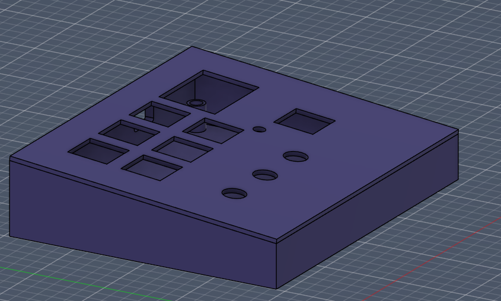
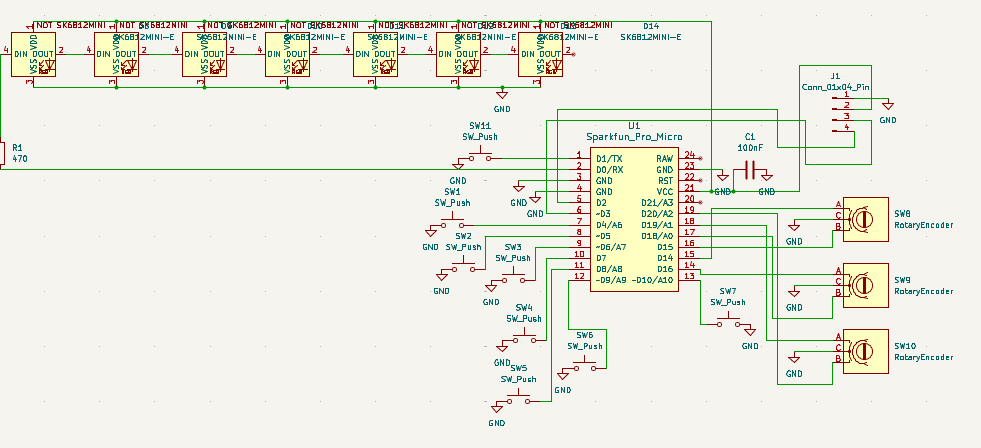
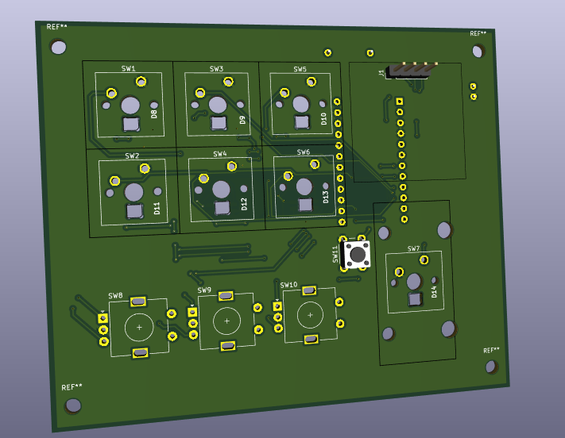
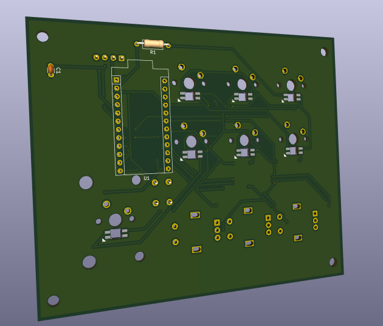
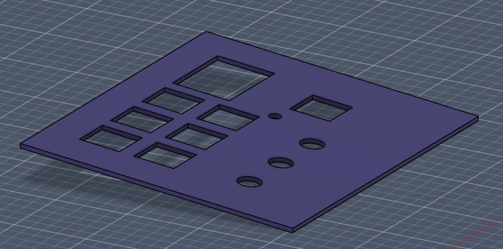
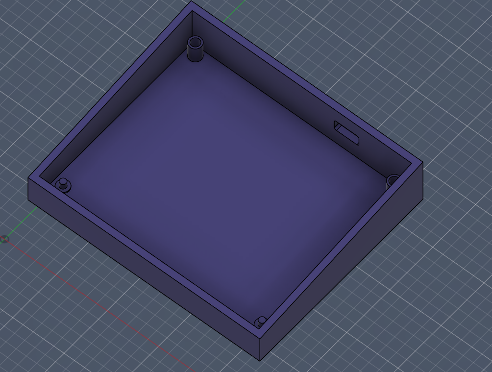

# AwesomePad
---

## Overview

This macropad was made and designed to help gamers who frequently use Discord and people who do livestreams. With 6 customizable switches, a 2U switch with push-to-talk functionality, 3 configurable knobs, and an OLED panel, it can do almost anything the user wants.

---

## Schematic

---

## PCB

---

## Case

The case is 3D printed in 2 parts (Top + Bottom) and fits the PCB snugly with cutouts for all switches, the encoder, the OLED, knobs, and the USB-C port.

---

## BOM (Bill of Materials)

## Main Components
| Item           | Qtd. | Name                                                         | Link                        |
| -------------- | ---- | ------------------------------------------------------------ | --------------------------- |
| Pro Micro      | 1    | **Pro Micro ATmega32U4 5V 16MHz USB-C 24 pin**               | https://amzn.eu/d/027iGPug  |
| OLED Display   | 1    | **OLED 0.96 inch SSD1306 I2C 4 pin**                         | https://amzn.eu/d/0ihcXsfb  |
| Rotary Encoder | 3    | **EC11 rotary encoder 20mm D shaft**                         | https://amzn.eu/d/0cy0BtVi  |
| Switches MX    | 7    | **Cherry MX switches pack small / Gateron switches 10 pack** | https://amzn.eu/d/0iitvTCB  |
| LEDs           | 6    | **WS2812B addressable RGB LED 5V**                           | .                           |
| Small Button   | 1    | **6mm tactile push button switch THT 4 pin**                 | .

## Interface
| Item          | Qtd. | Name                                      | Link                       |
| ------------- | ---- | ----------------------------------------- | -------------------------- |
| Keycaps 1U    | 6    | **1U keycaps MX individual PBT**          | https://amzn.eu/d/078EwmKl |
| Keycap 2U     | 1    | **2U keycap MX single keycap**            | https://acesse.one/y47nhj1 |

## Structure
| Item         | Qtd. | Name                              | Link                       |
| ------------ | ---- | --------------------------------- | -------------------------- |
| Screws        | 6    | **M3 6mm screws Phillips**        | https://amzn.eu/d/05gWZ59w |
| Rubber feet  | 4    | **adhesive rubber feet silicone** | https://amzn.eu/d/0bTfMZw4 |

---

## Built by

**Dineatriz** — Hackclub 2026

